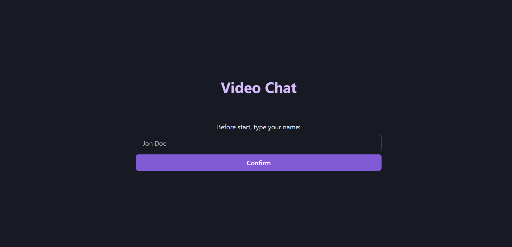
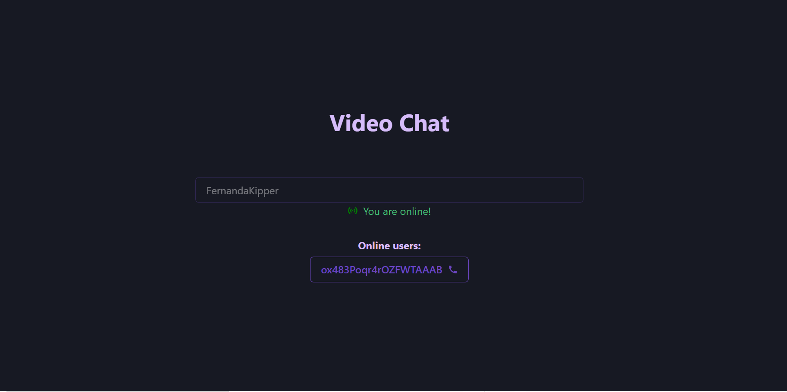
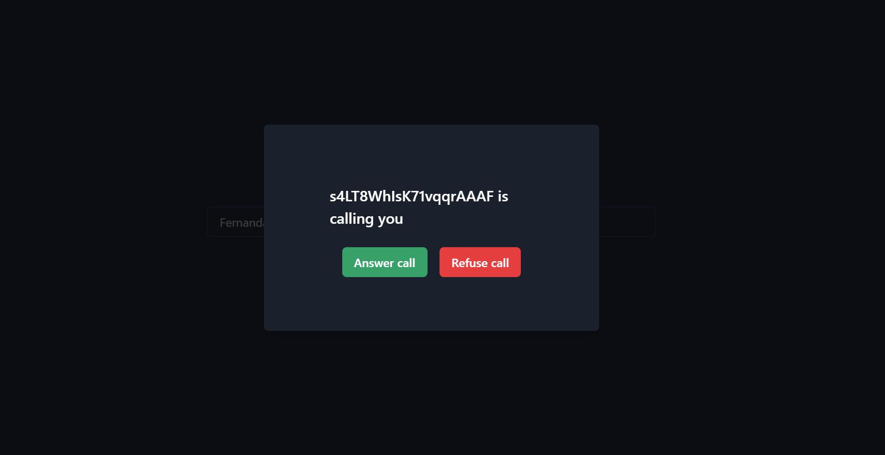
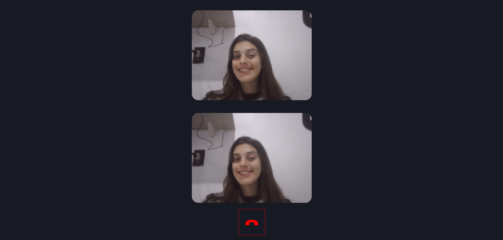

<h1 align="center" style="color: #805ad5; font-weight: bold;">Video-Chat</h1>

<p align="center">
 <a href="#tech">Technolgies</a> • 
 <a href="#clone">Clone</a> • 
 <a href="#contribute">Contribute</a> •
 <a href="#license">License</a>
</p>

<p align="center">
<b>This application is a video-chat where you can call and talk to online users!</b>
</p>
<p align="center">
  <p>
    
    
  </p>
  <p>
    
    
  </p>
</p>


<h2 id="tech">Technologies</h2>

### Client:
  Built using React JS, Mobx State Tree and React State for state manipulation and WebRTC API with simple-peer to to create Peer to Peer connections and share media stream

### Server
  Built in Node JS, using socket protocol to establishing the handshake (first contact) of users before then stablish the P2P connection

<h2 id="clone">Clone</h2>

<h4> Prerequisites</h4>

- Node >= 10.16 e npm >= 5.6 
- Package manager - NPM or YARN

<h4>Starting</h4>

```
git clone https://github.com/Fernanda-Kipper/video-chat.git
npm install
```

<h5>Start server</h5>

```
  //in root
  npm run dev
```

<h5>Start Client</h5>

```
  cd client
  npm start
```

<h2 id="contribute">Contribute 🚀</h2>

If you want to contribute, clone this repo, create your work branch and get your hands dirty!

```bash
git clone https://github.com/Fernanda-Kipper/video-chat.git
git checkout -b feature/NAME
```

 At the end, open a Pull Request explaining the problem solved or feature made, if exists, append screenshot of visual modifications and wait for the review!

[How to create a Pull Request](https://www.atlassian.com/br/git/tutorials/making-a-pull-request)

[Commit pattern](https://gist.github.com/joshbuchea/6f47e86d2510bce28f8e7f42ae84c716)


<h2 id="license">License 📃 </h2>

This project is under [MIT](LICENSE) license


